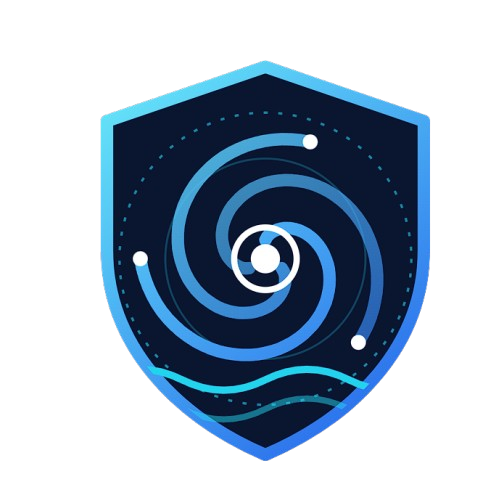
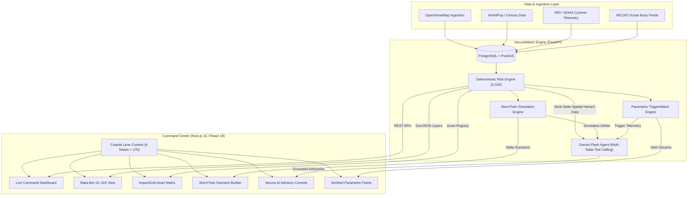

<div align="center">
  
  <h1>VarunaWatch</h1>
  <p><strong>AI-Powered Cyclone Impact & Infrastructure Resilience Command Platform</strong></p>
  <p><em>Developed by Team MetaMinds</em></p>

  <p>
    
    
    
    
    
    
    
  </p>
</div>

---

## Overview

**VarunaWatch** is an enterprise-grade parametric cyclone intelligence and infrastructure resilience command platform. Built to safeguard all **9 Indian Coastal States, National Grid, and Island Union Territories** across **7,516+ km** of high-vulnerability coastline (*Gujarat, Maharashtra, Goa, Karnataka, Kerala, Tamil Nadu, Andhra Pradesh, Odisha, West Bengal, Puducherry & Island UTs*), VarunaWatch unifies real-time storm tracking, high-resolution geospatial hazard modeling, digital twin scenario simulation, parametric SDRF/NDRF insurance triggers, and explainable AI operational advisories under **one single roof**.

No tab-hopping. No disconnected spreadsheets. No manual GIS synthesis during crisis hours.

```
"Storm Telemetry & Forecasts" ──▶ Deterministic Spatial Engine ──▶ ImpactGrid (0–100 Vulnerability)
                                             │
"What-If Category 4 Landfall" ──▶ StormTwin Digital Simulation ──▶ Live Cascading Delta Analysis
                                             │
"Draft State Evacuation SOP"  ──▶ Varuna AI Copilot (Gemini) ──▶ Evidence-Grounded Response Plan
```

### Core Architecture Rule
> **"The Backend computes every number; AI explains, prioritizes, and advises."**  
> Every vulnerability score (0–100), inundation depth, wind field, road cutoff, and trigger confidence is deterministically calculated by backend physics and geospatial models. Google Gemini is grounded strictly in raw telemetry and tool calls, completely eliminating hallucinations in disaster response.

---

## Application Walkthrough

```
┌────────────────────────────────────────────────────────────────────────────────────────┐
│                                 VARUNAWATCH PLATFORM                                   │
├─────────────────┬──────────────────┬─────────────────┬────────────────┬────────────────┤
│ 🛰️ Live Tracker │ 🌐 ImpactGrid    │ 🌪️ StormTwin    │ 🤖 Varuna AI   │ 🛡️ Sentinel   │
│ Dual Basin Met  │ Critical Assets  │ What-If Digital │ Grounded Multi-│ Parametric     │
│ 7,516 km Grid   │ 0-100 Risk Index │ Twin Simulation │ Tool Advisory  │ SDRF Triggers  │
└─────────────────┴──────────────────┴─────────────────┴────────────────┴────────────────┘
```

1. **Landing Page (`/`)**: Interactive command hero featuring live **fluid cyclone & wind breeze particle motion**, Pan-India state breakdown badges, and quick module launchers.
2. **Command Center (`/dashboard`)**: Unified situational dashboard with dynamic **Coastal State / Lane Switcher**, live surveillance status bar, active KPI metrics, zero-lag Carto Dark Matter GIS map, and live alert feeds.
3. **Storm Intelligence (`/storm`)**: Real-time dual-basin cyclone trajectory (Bay of Bengal & Arabian Sea), 72-hour cone of uncertainty, landfall coordinates, and time-series wind/rainfall forecasts.
4. **ImpactGrid (`/infrastructure`)**: Multi-state spatial risk register scoring every critical asset (hospitals, substations, port terminals, relief shelters, bridges, and coastal highways like NH-16 & NH-66) with 0–100 vulnerability indexes and multi-factor inspection modals.
5. **StormTwin Scenarios (`/stormtwin`)**: Interactive digital twin simulator allowing disaster commanders to adjust cyclone intensity (Categories 1–5), rainfall multipliers, and surge heights across any Indian coastal state to calculate live cascading delta impacts.
6. **Varuna AI Copilot (`/ai`)**: Grounded generative AI workspace utilizing Gemini function-calling with quick corridors (Sundarbans, Paradeep, Godavari Delta, Chennai Coromandel, Kochi Malabar, Mumbai MMR, Kutch & Saurashtra) to generate formal district-level evacuation advisories and multi-section response reports.
7. **VarunaVision (`/satellite`)**: Multi-temporal satellite earth observation layers for pre-storm baseline, current radar reflectivity, and projected flood inundation extents.
8. **Sentinel & Advisories (`/advisories`)**: Parametric trigger engine monitoring wind thresholds, storm surge levels, and rain accumulations with pre-approved SDRF/NDRF liquidity allocations and automated emergency call dispatch.

---

## Pan-India Coastal Lanes Grid

| Coastal Lane | Basin | Coastline | Key Districts & Ports | State Response Force |
| :--- | :--- | :--- | :--- | :--- |
| **All Coastal India (National Grid)** | Pan-India | **7,516 km** | All Major Ports (JNPT, Paradip, Chennai, Vizag, Kandla, Cochin) | NDRF & Joint SDRF Pool |
| **Gujarat** | Arabian Sea | **1,600 km** | Deendayal Port (Kandla), Mundra, Porbandar, Dwarka, Surat | Gujarat SDRF & GSDMA |
| **Tamil Nadu** | Bay of Bengal | **1,076 km** | Chennai Port, Kamarajar (Ennore), Cuddalore, Nagapattinam, VOC | Tamil Nadu SDRF Taskforce |
| **Andhra Pradesh** | Bay of Bengal | **974 km** | Visakhapatnam Port, Kakinada Deepwater, Machilipatnam, Bapatla | AP SDRF Rapid Deployment |
| **Maharashtra** | Arabian Sea | **720 km** | JNPT, Mumbai Port Trust, Alibaug, Ratnagiri, Sindhudurg | Maharashtra SDRF & MCGM |
| **Kerala** | Arabian Sea | **590 km** | Cochin Port, Vizhinjam International, Alappuzha, Kozhikode | Kerala SDRF Mitigation Wing |
| **Odisha** | Bay of Bengal | **480 km** | Paradip Port, Dhamra Port, Gopalpur, Puri, Balasore | ODRAF (Odisha Rapid Action) |
| **Karnataka** | Arabian Sea | **320 km** | New Mangalore Port, Karwar Sea Bird, Udupi, Honnavar | Karnataka SDRF Marine Wing |
| **West Bengal** | Bay of Bengal | **157 km** | Sundarbans Biosphere Delta, Haldia Dock Complex, Digha | WB SDRF & Civil Defence |
| **Goa** | Arabian Sea | **101 km** | Mormugao Port, Panaji Seaport, Zuari Estuary | Goa SDRF Marine Division |
| **Puducherry & Island UTs** | Pan-India | **1,000 km** | Puducherry, Karaikal, Port Blair (A&N), Kavaratti (Lakshadweep) | UT Disaster Response Forces |

---

## Key Features

| Feature | Description |
| :--- | :--- |
| **Pan-India Multi-State Engine** | Full coverage of all 9 coastal states & UTs with dynamic state filtering, regional bounds, and localized GIS centroids. |
| **Realistic Cyclone Particle Motion** | Interactive fluid canvas simulating atmospheric vortex streamlines, breeze drift, and cyclonic eye physics. |
| **Deterministic Risk Engine** | Geospatial multi-criteria algorithm scoring assets from 0 to 100 based on surge depth, wind exposure, elevation, criticality, and accessibility. |
| **StormTwin Digital Simulation** | Category 1–5 slider with real-time recalculation of flooded hospitals, threatened substations, and inundated road segments per state. |
| **Grounded Varuna AI Copilot** | Google Gemini integration with server-side tool calling to produce evidence-backed operational SOPs without hallucinations. |
| **Parametric Sentinel Watch** | Automated threshold monitoring (wind > 140 km/h, surge > 2.5m) for parametric disaster payouts to state SDRF windows. |
| **Zero-Lag MapLibre GIS** | Dual Carto vector/raster tile switcher (Dark Matter & Voyager) with instant zero-lag dark/light theme switching. |
| **Zero-Config Demo Mode** | Runs immediately out of the box with comprehensive deterministic multi-state fallback data. |

---

## Tech Stack

| Layer | Technology | Purpose / Notes |
| :--- | :--- | :--- |
| **Frontend Framework** | **Next.js 15.5 (App Router)** | Server Components, modern client layouts, dynamic client routing |
| **UI & Language** | **React 19 · TypeScript 5.7** | Strict mode typing, responsive state management |
| **Styling** | **Tailwind CSS v4** | Dark/light theme support, custom semantic UI tokens, smooth transitions |
| **Mapping & Spatial UI** | **MapLibre GL & Carto** | Zero-lag WebGL rendering, custom markers, GeoJSON storm tracks |
| **Motion & Animation** | **HTML5 Canvas & Framer Motion** | High-performance 60fps cyclonic wind breeze simulation |
| **Icons & Visuals** | **Lucide React** | Clean, consistent operational icon set |
| **Backend API** | **FastAPI (Python 3.11)** | High-performance asynchronous REST API with Pydantic validation |
| **AI Advisory Engine** | **Google Gemini 2.0 / 3.7 Flash** | LLM with native tool-calling and context-grounded synthesis |
| **Database & GIS** | **PostgreSQL + PostGIS** | Spatial querying, hazard geometry buffers, asset point-in-polygon |
| **Deployment** | **Vercel & Docker** | Native Vercel deployment with `vercel.json` and Docker Compose |

---

## System Architecture


## Getting Started

### 1. Quickstart with Docker Compose

```bash
# Clone the repository
git clone https://github.com/Premkumar1845/VarunaWatch.git
cd VarunaWatch

# Copy environment variables
cp .env.example .env

# Build and start all services (PostgreSQL/PostGIS, FastAPI backend, Next.js frontend)
docker compose up --build
```

- **Frontend Application**: [http://localhost:3000](http://localhost:3000)
- **Backend API Docs (Swagger)**: [http://localhost:8000/docs](http://localhost:8000/docs)
- **PostGIS Database**: `localhost:5432`

---

### 2. Manual Local Setup

```bash
# 1. Install Python dependencies
pip install -r requirements.txt

# 2. Run both servers
npm run backend   # Starts FastAPI on http://localhost:8000
npm run dev       # Starts Next.js on http://localhost:3000
```

---

## API Reference

- `GET /api/cyclone/current?state={ap|od|tn|mh|gj|wb|kl|ka|ga|ut|all}` — Current cyclone status per state or national grid.
- `GET /api/cyclone/forecast?state={state}` — 72-hour forecast track, cone coordinates, and rainfall/wind forecasts.
- `GET /api/hazards?category={1-5}&state={state}` — Hazard zones with deterministic risk scores.
- `GET /api/infrastructure?state={state}&asset_type={hospital|power|road|shelter|bridge}` — Scored critical infrastructure register.
- `GET /api/roads/affected?state={state}` — Inundation risk across coastal highway segments.
- `GET /api/risk/summary?state={state}` — Aggregated risk summary, exposed population, and facility threat counters.
- `POST /api/simulation?state={state}` — Digital twin what-if scenario simulation.
- `POST /api/ai/analyze` — Conversational assistant with multi-state telemetry context.
- `POST /api/ai/advisory` — Formal operational SOP advisory generator for state collectors & SDRF units.

---

## Security & Reliability

- 🔒 **Server-Only API Secrets**: Google Gemini and external API keys are kept strictly within backend environment configurations.
- 🛡️ **Zero Hallucination Architecture**: AI models cannot fabricate operational data; all figures are fetched via programmatic tool calls to backend models.
- 📐 **Strict Typing & Schema Validation**: Pydantic models on the backend and TypeScript interfaces on the frontend guarantee robust data contracts.
- ⚡ **Graceful Offline Fallback**: The platform operates seamlessly in low-connectivity scenarios via structured local telemetry stores.

---

## Roadmap

- [x] **Core Parametric Risk Engine** (Deterministic 0–100 scoring).
- [x] **Pan-India Multi-State Expansion** (All 9 Indian Coastal States + Island UTs).
- [x] **Interactive Cyclone & Wind Breeze Motion Background**.
- [x] **Official Brand Logo Integration** across all modules.
- [x] **StormTwin Digital Simulation Engine** (Categories 1–5 with cascading failure detection).
- [x] **Varuna AI Decision Copilot** with tool calling and state advisory generation.
- [x] **Zero-Lag MapLibre GIS Mapping** with dual Carto tile dark/light modes.
- [x] **Vercel Production Deployment Configuration**.
- [ ] **Automated WhatsApp / SMS Broadcast Relays** for field disaster units.
- [ ] **Offline PWA Support** for emergency teams with low satellite bandwidth.

---

## Team

**Team MetaMinds**  
*Building next-generation intelligent platforms for disaster resilience and humanitarian impact.*

© MetaMinds · **VarunaWatch** — *Intelligence Before Impact.*
